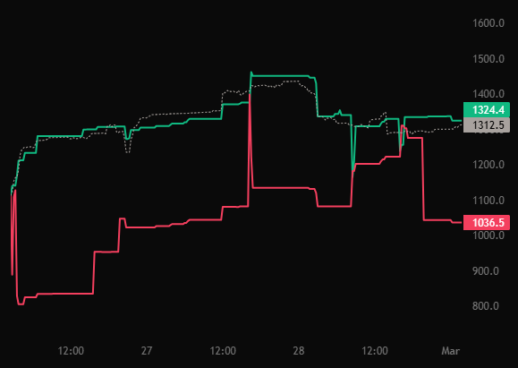
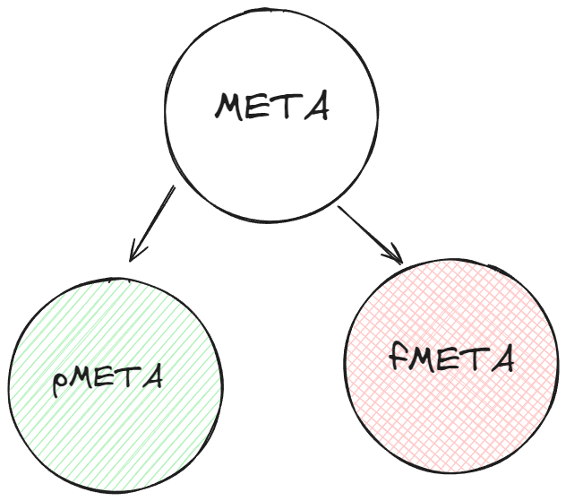
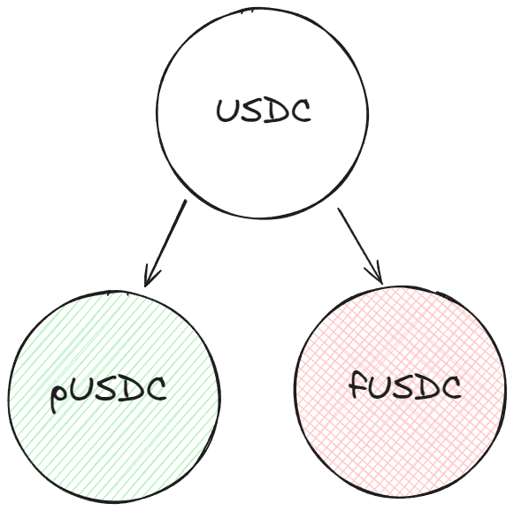
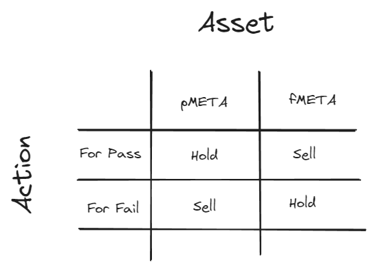
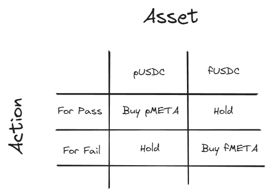

In futarchy markets, your trades signal whether you think a proposal should pass or fail. To participate, you’ll mint conditional tokens and trade them to raise the market cap of your preferred outcome or lower the opposing one.

Each futarchy proposal includes two markets:
- Pass (green)
- Fail (red)

<figure><figcaption></figcaption></figure>

[Example of a passing proposal](https://metadao.fi/metadao/trade/HREoLZVrY5FHhPgBFXGGc6XAA3hPjZw1UZcahhumFkef)

When a proposal is created, the proposer sets a pass threshold. This is the percentage by which the pass market must exceed the fail market for the proposal to succeed.

For example, if the threshold is 3%, the price of the pass market must be at least 3% higher than the fail market during the voting window for the proposal to pass. If prices remain within that 3% margin, the proposal fails.

Since both markets start at equal value, it’s up to traders to move prices either toward passing or failing the proposal.

Your goal is to raise the market cap of the side you support:
- If you think the proposal should pass, increase the pass market’s price beyond the threshold.
- If you think it should fail, keep the prices within the threshold or shift them in favor of the fail side.

Here's how it works in practice:

## Step 1: Mint Conditional Tokens

To participate, you first mint **conditional tokens** — these represent two possible ways you can influence the market.

Let’s walk through an example using MetaDAO governance. 

You can mint conditional tokens using one of two assets:
- **META** (MetaDAO's native governance token)
- **USDC** (a stablecoin)

Depending on the asset you choose, you'll receive two tokens:

If minting with META:
- pMETA (pass)
- fMETA (fail)

<figure><figcaption></figcaption></figure>

If minting with USDC:
- pUSDC (pass)
- fUSDC (fail)

<figure><figcaption></figcaption></figure>

Using META lets you affect the relative prices of the fail or pass market. Using USDC lets you add capital directly into the outcome you support, increasing its market cap.

## Step 2: Trade Based on What You Believe

Once you’ve minted, you can express your belief by trading your conditional tokens.

With META:
- In favor of pass: Sell fMETA to lower the fail market and hold pMETA.
- In favor of fail: Sell pMETA to lower the pass market and hold fMETA.

<figure><figcaption></figcaption></figure>

With USDC:
- In favor of pass: Use pUSDC to buy pMETA to raise the pass market.
- In favor of fail: Use fUSDC to buy fMETA to raise the fail market.

<figure><figcaption></figcaption></figure>

## Step 3: Redeem tokens after trading has concluded

When the voting window ends and the outcome is finalized, only one set of tokens becomes redeemable:

If the proposal passes:
- Only pTokens (pMETA, pUSDC) are redeemable

If the proposal fails:
- Only fTokens (fMETA, fUSDC) are redeemable

**The losing side’s tokens become worthless.**

In theory:
- If you supported “pass,” you should be holding pMETA and/or pUSDC.
- If you supported “fail,” you should be holding fMETA and/or fUSDC.

## Edge Cases: Why You Might Hold the Opposite Tokens of Your Belief

In most cases, traders hold tokens that reflect their belief: pass tokens if they want a proposal to pass, or fail tokens if they want it to fail. But there are edge cases where your token holdings might not directly align with your opinion. Here are the three most common:

### 1. Trading for Profit (Not Belief)

You might believe the proposal should pass but temporarily hold fail tokens (like fMETA or fUSDC) because:
- You expect the fail market price to rise in the short term
- You are taking advantage of price volatility
- You plan to flip positions later for a better return

In this case, your goal is to maximize profit, not necessarily to influence the proposal outcome.

### 2. Hedging Your Position

If you're unsure about how the market will evolve, you might hold both pass and fail tokens as a hedge.

Examples:
- You minted both pMETA and fMETA and haven’t traded yet
- You support pass but keep some fMETA for downside protection

This approach reduces risk while you wait for clearer market signals.

### 3. You Haven’t Traded Yet

After minting conditional tokens (p/fMETA or p/fUSDC), you automatically hold both sides. Until you actively trade to express your stance, you are effectively neutral, even if you have a strong belief.

This is a common state for participants who are still evaluating or waiting for better market conditions before acting.
