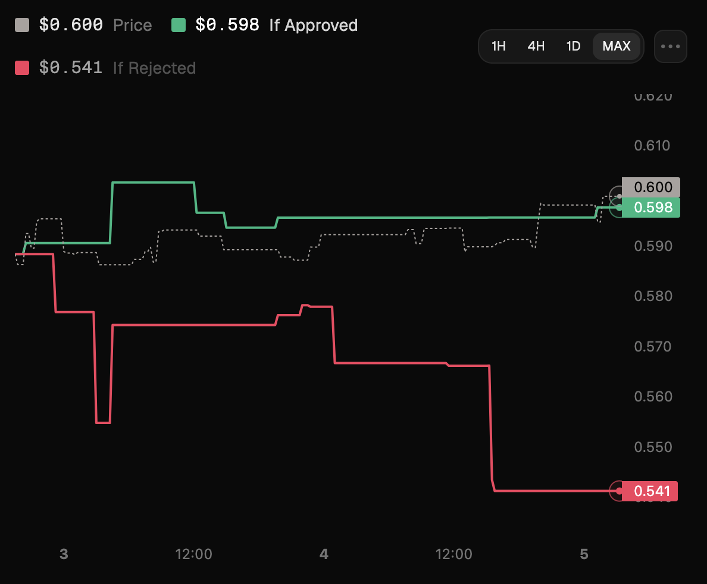
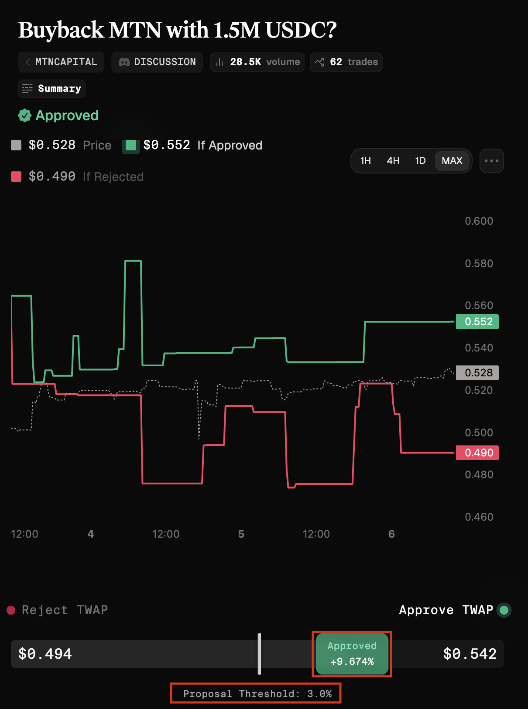
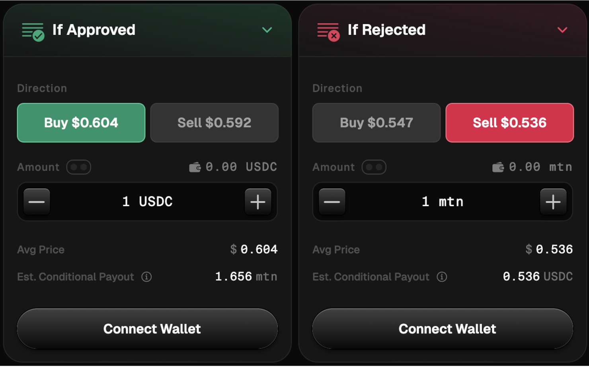
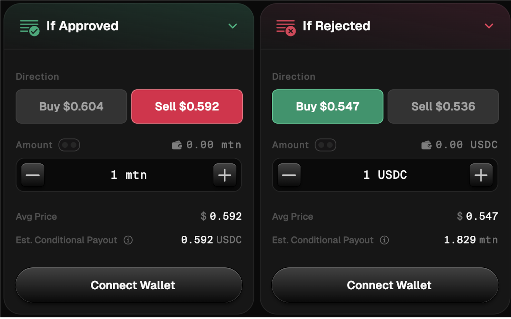
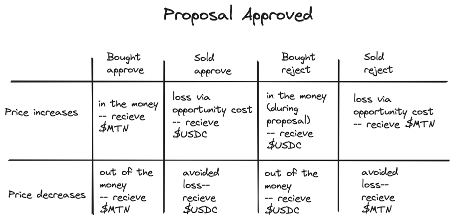
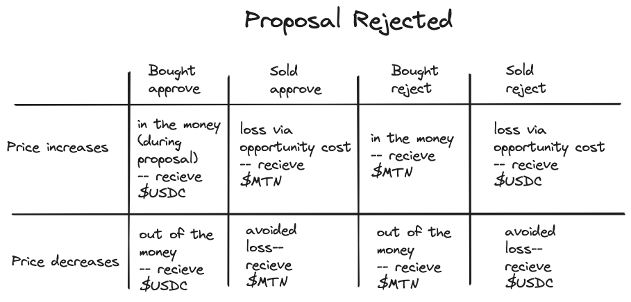

In futarchy markets, your trades signal whether you believe a proposal should pass or fail. You influence the outcome by trading conditional tokens that adjust the market prices.

## Market Structure

Each proposal creates two opposing markets:
- Approve (green) – signals support for the proposal.
- Reject (red) – signals opposition to the proposal.

To participate, you mint (trade) conditional tokens to raise the market cap of your preferred outcome or lower the market cap of the opposing outcome.

<figure><figcaption></figcaption></figure>

[Example of an approved proposal](https://metadao.fi/metadao/trade/HREoLZVrY5FHhPgBFXGGc6XAA3hPjZw1UZcahhumFkef)

### Approval Threshold

Each DAO defines an approval threshold. This threshold is the percentage by which the Approve market must outperform the Reject market for the proposal to pass.

<figure><figcaption></figcaption></figure>

**Example:** If the threshold is set to 3%, the Approve market price must be at least 3% higher than the Reject market price during the voting window. If it does not cross this margin, the proposal fails.

### How Proposals are Decided

At the start of every vote, the Approve and Reject markets begin at equal value. Traders determine the outcome by moving prices away from this starting point.

Your role as a trader is to shift the balance between the two markets so the side you support outweighs the other.
- If you think the proposal should pass: increase the approve market’s price beyond the threshold, or lower the market price of the reject side. 
- If you think it should fail: increase the reject market’s price within the threshold, or lower the market price of the approve side.

## Step 1: Choose a side and mint your position

**Let’s use MountainDAO’s MTN token as an example.**

First, decide whether you support Approve or Reject, then select how to enter:
- To support approval, buy Approve with USDC or sell Reject with MTN.

<figure><figcaption></figcaption></figure>
  
- To support rejection, buy Reject with USDC or sell Approve with MTN.

<figure><figcaption></figcaption></figure>

If you trade in and out of markets before settlement, your profit or loss comes from price changes between entry and exit. If the price moves in your favor you are “in the money.” If it moves against you, you are “out of the money.”

**Example:** Buying $100 of Approve tokens at $0.45 and later selling at $0.55 returns about $122, a $22 profit. Selling at $0.35 instead reduces your position to about $78, a $22 loss, even though settlement has not yet occurred.

## Step 2: Redeem tokens after trading has concluded
When the voting window closes and the result is finalized, your remaining tokens redeem into assets according to the outcome. 

**If the proposal is approved:**
- Holding Approve market tokens (buy Approve or sell Reject) redeems in MTN.
- Holding Reject market tokens (buy Reject or sell Approve) redeems in USDC.
<figure><figcaption></figcaption></figure>

**If the proposal is rejected:**
- Holding Approve market tokens (buy Approve or sell Reject) redeems in USDC.
- Holding Reject market tokens (buy Reject or sell Approve) redeems in MTN.
<figure><figcaption></figcaption></figure>

Redemption is proportional to your token balances at close. Any gains or losses from active trading come from price moves before settlement.

## Example: Arbitraging markets

Suppose you enter the market early and buy Approve when both markets start at equal value. You expect MTN to rise by about 5% if the proposal passes. However, as trading continues, the Approve market climbs and is now priced at a 15% premium over Reject.

At this point, the expected upside of 5% is smaller than the 15% premium already priced in. The trade is no longer attractive to hold. To take advantage of the mispricing, you sell your Approve position. By selling, you help bring the price closer to fair value, and if the market corrects toward your 5% expectation, you profit from the adjustment, even though you still believe the proposal itself is positive.
